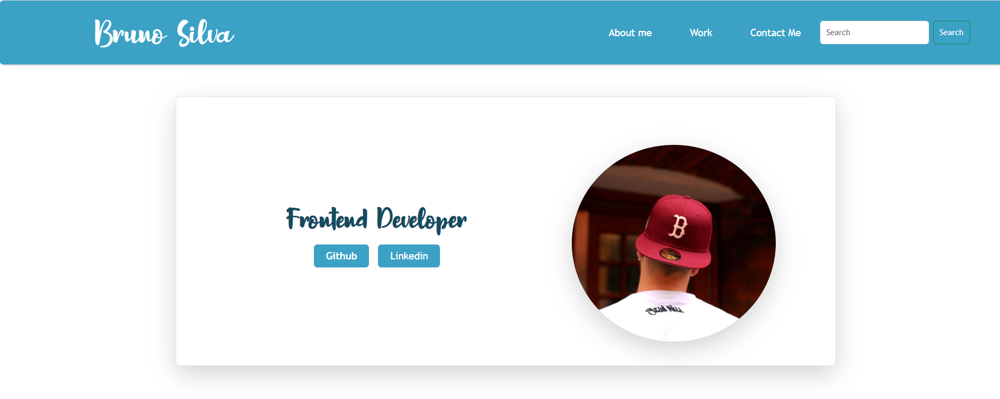
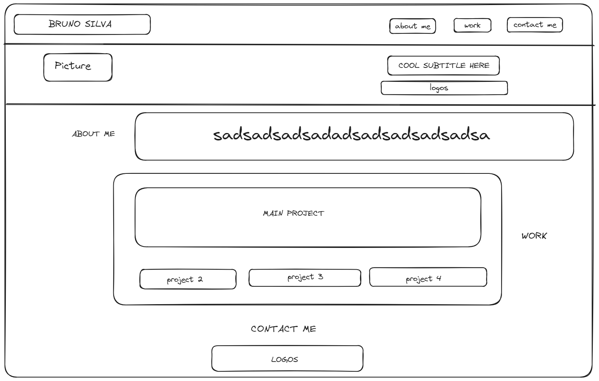

# Bruno Silva Bootstrap Portfolio

## The Repository

This repository is where I code my [Portfolio](https://github.com/blaztted/Bootstrap-Portfolio) in order to showcase my skills and projects to potential employers or clients.

## Portfolio

  

You can find the Portfolio [here](https://blaztted.github.io/Bootstrap-Portfolio/).

## Diagram

  

## Links

https://github.com/blaztted/Bootstrap-Portfolio

https://blaztted.github.io/Bootstrap-Portfolio/

## License

Copyright (c) Microsoft Corporation. All rights reserved.

Licensed under the [MIT](LICENSE.txt) license.
